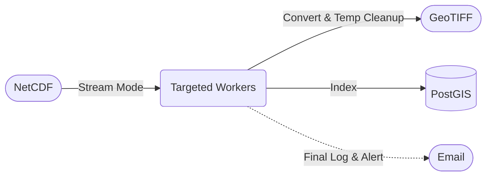
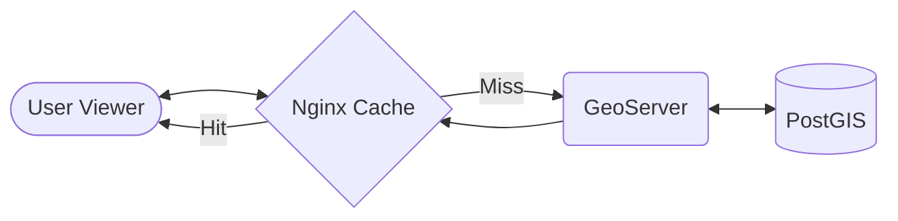

# WMS Sea-Level Forecast Pipeline — Overview

## Data retrieval

```mermaid
flowchart LR
    Cron([Cron 09/14/21]) -.-> Pipe(Python Stream Pipeline)
    Storage([Monitor 10:00]) -.-> DB[(PostgreSQL)]
    FTP[(JRC FTP)] -->|NetCDF (1-by-1)| Pipe
    Pipe <-->|Verify Tracking| DB
```

Data retrieval is orchestrated by a Python-based pipeline that automatically connects to the JRC-FLOODS FTP server to discover new NetCDF sea-level forecast files. The system handles intelligent scheduling and state tracking:
- **Scheduling**: The process runs automatically via cron jobs (`scripts/wms_crontab.txt`). While set in UTC (08:00, 13:00, 20:00), the execution matches local real-world intervals at **09:00, 14:00, and 21:00**. An additional job runs daily at 10:00 (local time) to monitor and alert on server storage limits.
- **Incremental Stream Processing**: It discovers and downloads only the files that have not yet been processed. The pipeline operates in a stream mode (downloading and fully processing one NetCDF file end-to-end before moving to the next) ensuring immediate availability and preventing catastrophic memory overloads. To achieve this statefulness, it uses a dedicated tracking footprint in the PostgreSQL database.
- **Connection Management**: Instead of hitting the database directly and exhaustively, the pipeline and other services connect to PostgreSQL through **PgBouncer**, which runs in transaction pool mode (configured for up to 500 max client connections) to ensure database stability.

## Data conversion



Once the NetCDF files are safely retrieved, the data conversion process transforms them into georeferenced raster layers ready for WMS distribution.
- **Targeted Pipeline Workers**: A main orchestrator (`run_all_wms.py`) delegates each newly downloaded file directly to specialized workers (`static_wms.py`, `video_wms.py`, `points_wms.py`). They extract forecast variables natively and immediately convert them into GeoTIFF format, allowing for constant cleanup of temporary buffers (`AUTO_CLEANUP=true`).
- **Layer Types**: The conversion accounts for three distinct layer mechanisms:
  - **Static**: Probability maps (e.g., 10y, 100y, 500y) utilizing the TIME dimension.
  - **Video / Time-series**: Wave and water-level forecasts.
  - **Points**: Point-type Coastal forecasts requiring both TIME and ELEVATION dimensions.
- **Database & Granules**: During conversion, an ImageMosaic granule index is aggressively built. To handle high-performance spatial queries, the **PostGIS/PostgreSQL** container is heavily tuned (e.g., 8GB `shared_buffers`, 24GB `effective_cache_size`).
- **Alerting & Logs**: After the entire pipeline processing (both retrieval and conversion) completes natively, automated email notifications (with execution logs securely attached) are sent to administrators. Throughout the process, pipeline logs run centrally and are continuously aggregated into **Loki** via **Promtail**. 

## Data plotting



The final phase involves serving, proxying, and visualizing the converted data. This is heavily optimized for speed and high availability via a coordinated Docker stack.
- **GeoServer**: Converted layers are instantly published to a Dockerized **GeoServer**, which relies on a tuned JVM (allocation limits up to 24GB RAM and parallel garbage collection) to efficiently render the WMS and WCS output natively from the PostGIS ImageMosaic.
- **Nginx Reverse Proxy & Caching**: 
  - An **Nginx** container acts as the main entry point (port 80). 
  - To drastically boost viewer performance and reduce GeoServer load, it intercepts GeoWebCache (GWC) tile requests (`/geoserver/gwc/`). 
  - It utilizes a robust **7-day proxy cache** (up to 2GB) specifically for GWC tiles. 
  - Nginx further explicitly injects `Cache-Control` immutable headers to enable browser-level caching (max-age 86400) and gracefully handles CORS natively. 
  - Standard WMS admin/API requests (`/geoserver/`) smartly bypass this cache.
- **Web Viewer**: A Leaflet-based frontend (simultaneously served via Nginx) allows users to connect natively to these accelerated endpoints. Users can browse layers natively, manipulate animations via a time slider, shift point elevations, and blend probabilities effortlessly.
- **Observability Stack**: Data plotting traffic and resource utilization are natively monitored. **Prometheus** scrapes metrics precisely from GeoServer (`cAdvisor`), Nginx (`nginx_exporter`), Postgres (`postgres_exporter`), and PgBouncer (`pgbouncer_exporter`). **Grafana** then displays this telemetry via highly customized dashboards natively on port 3000, giving full visibility into tile cache hits, latency, and rendering operations.
